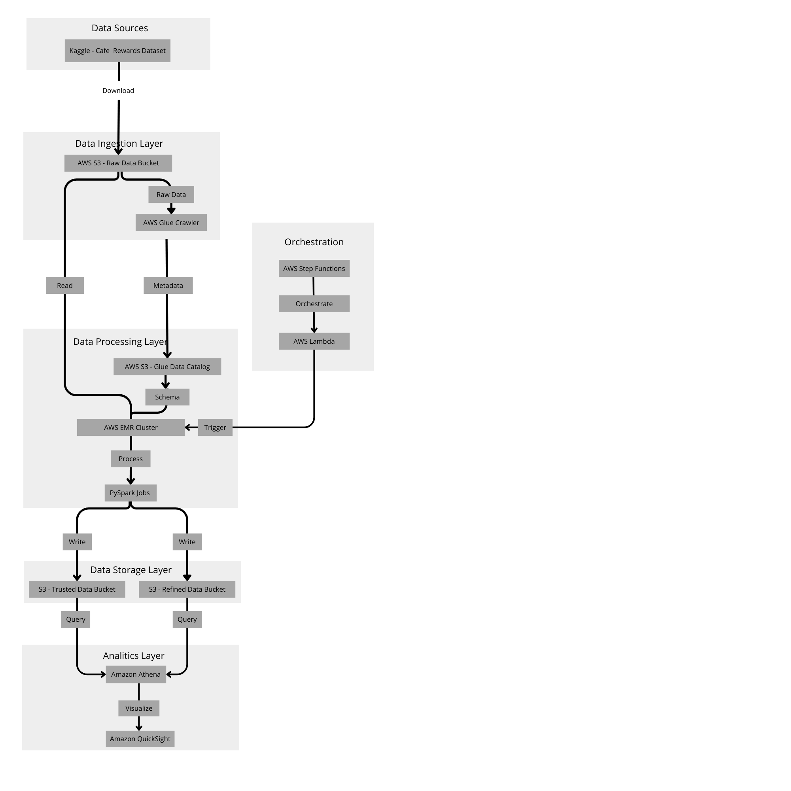

# Café Rewards Data Pipeline

This project implements a data processing pipeline for analyzing the Café Rewards Offer Dataset using PySpark.

## Architecture



### Design Choices & Technologies
- **PySpark**: Selected for distributed data processing capabilities and scalability.
- **Three-Layer Architecture**:
  - Raw Layer: Direct ingestion from source files
  - Trusted Layer: Cleaned and structured data
  - Refined Layer: Aggregated metrics and analytical views
- **AWS Cloud Implementation**: Leverages S3 for storage, EMR for processing, and Glue for data catalog.

## Setup & Execution

### Prerequisites
- Python 3.8+
- PySpark 3.1+
- Java 8+

### Installation
```bash
# Clone the repository
git clone https://github.com/yourusername/cafe-rewards-pipeline.git
cd cafe-rewards-pipeline

# Install dependencies
pip install -r requirements.txt
